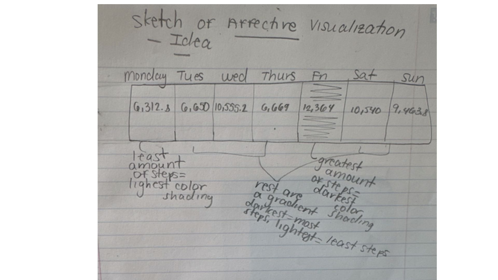
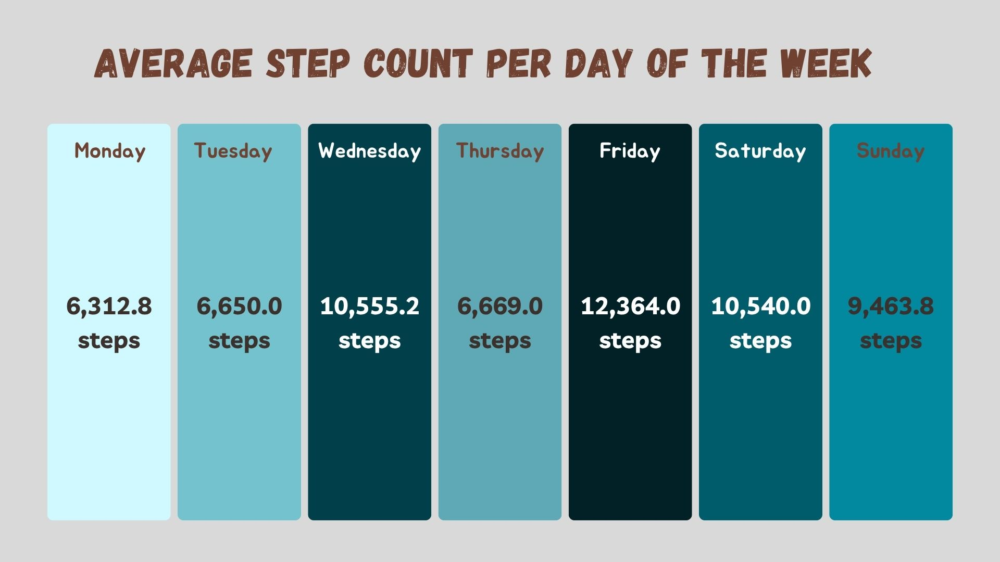
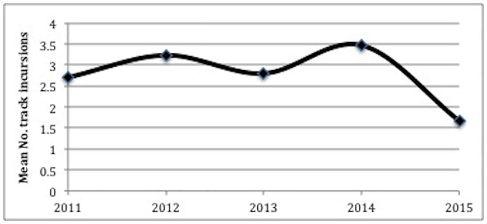

Link to repository: https://github.com/meholtam/ENVS-193DS_homework-03

Problem 1: Personal Data

```{r set up, message=FALSE, warning=FALSE}
#making sure no messages show when loading in packages
library(tidyverse)
library(here)
library(gt)
library(ggplot2)
library(readxl)
```

Problem 1: Personal Data

a. Data summarizing
I am calculating the mean number of steps I took each day to compare average step count between weekdays. I believe I walk the most on Wednesdays, because I have classes to walk to but also free time to work out and go on walks as I do not have work, so I am curious if my data reflects this. 

b. Visualization
```{r personal data visualization}

# load data
my_data <- read_csv("~/Desktop/ENVS-193DS/ENVS-193DS_homework-03/data/193DS Data - Sheet1.csv")

my_data$`Day of the Week` <- factor(my_data$`Day of the Week`,
                                  levels = c("Monday", "Tuesday", "Wednesday", "Thursday", "Friday", "Saturday", "Sunday"))


ggplot(data = my_data, # using the data frame my_data
       aes(x = `Day of the Week`, # 2. naming the aesthetics: the x-axis should be the day of the week
           y = Steps)) + # the y-axis should be step count
  geom_boxplot(fill = "lightblue", color = "darkblue") + # 3. the plot should be a boxplot and changes the inside and outline color of the boxes
  stat_summary(fun = mean, geom = "point", shape = 20, size = 3, color = "red") + # Add mean points
  labs(x = "Day of the Week", # relabeling the x-axis
       y = "Steps", # and the y-axis 
       title = "Step Count Patterns Across the Week") + # adding a title 

  theme_minimal() # changing the theme from default
```

c. Caption
The box plot shows the mean number of steps taken each week day. The data was collected from the start of April 2025 to the end of May 2025. The horizontal line inside each box represents the median amount of steps taken on that day of the week, while the box itself represents the interquartile range. The bottom of the box represents the 1st quartile, or the 25th percentile, while the top of the box represents the 3rd quartile, or the 75th percentile. The whiskers, or lines extending from the box, show the typical range of step count. The dots outside of the box represent outliers, or days in which step count was far outside of the average for that day. The red dot represents the mean number of steps for each day of the week. 

d. Table Presentation
# Create a table summarizing the same data visualized in part b. 

```{r table presentation}

# Summarize the mean steps per day
mean_table <- my_data %>%
  group_by(`Day of the Week`) %>%
  summarise(Mean_Steps = mean(Steps, na.rm = TRUE)) %>%
  arrange(match(`Day of the Week`, c("Monday", "Tuesday", "Wednesday", "Thursday", "Friday", "Saturday", "Sunday")))

# Create a gt table
mean_table %>%
  gt() %>%
  fmt_number(
    columns = Mean_Steps,
    decimals = 0
  ) %>%
  tab_header(
    title = "Mean Steps Per Day of the Week"
  )
```


Problem 2: Affective Visualization 

a. 
For my personal data, an example of affective visualization that I could use would be a week calendar. On this calendar, each day of the week would display the mean number of steps I take on average during that day of the week. The day of the week with the largest number of steps would be a very dark color, where the day of the week with the least amount of steps would be a light color. The entire calendar would be a gradient displaying most amount of steps to least amount of steps. This would create an interesting and easy-to-follow representation of how each day of the week’s average step count differs. 

b. Sketch of Idea


c. Draft of Visualization


d. Artist Statement

My piece is a week calendar displaying the average number of steps I take depending on the day of the week. The darker the color of the box, the more steps I take. Clearly, Friday had the greatest average number of steps, as the color of the box is the darkest, while Monday had the least average number of steps as the color of the box is the lightest. In creating this visualization, I was influenced by Giorgia Lupi and Steanie Posavec’s “Dear Data” project because of their use of everyday objects to represent their data. They made a postcard have significance to their project, while I am allowing the everyday object of a calendar to be significant to my project. I was also very inspired by their use of color and wanted to incorporate that into my project. My work is in digital form. I used Canva to create a week calendar and colored each day of the week using the software on this website. In R studio, I took my step count data and found the average amount of steps I took per day of the week. These were the numbers that I used to fill in my calendar. 

Problem 3: Statistical Critique

a. Revisit and Summarize 
The statistical test the authors are using to address their main research question is an ANOVA. The predictor variable is the nest protection strategy used (anti-predator meshing or lethal fox control). The response variable was the percentage of turtle nests breached by the European red fox. The ANOVA test is comparing the mean breach rates of nests when the anti-predator meshing and lethal fox control methods are used versus when only anti-predator meshing is used. 



b. Visual Clarity

The figure I included in Part A clearly represents the statistics of the project clearly. The x and y-axis are included in a logical position. The y-axis represents the mean number of track incursions, which is a summary statistic in itself. However, there is not extra information included, such as standard error or model predictions, which would paint an even more full picture. 


